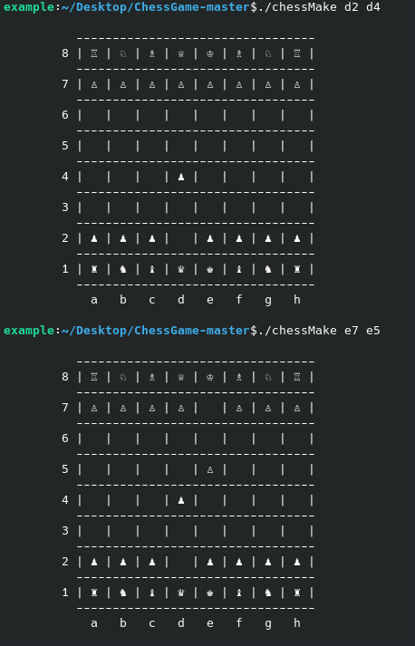

# chess-cli
Chess game

The convention is that the first position is the previous position and the second one is the next.
 b1 c3 would mean a knight going from b1 to c3

FEATURES:
* preventing illegal moves (passing over other pieces, eating one's own allies, etc.)
* handling the special turns (like pawn promotion)
* check detection, and prevention of any move that doesn't solve it
* recognizes checkmates and stalemates
* special options, like reset, or sandbox mode to debug or cheat

TO RUN
make
./chessMake
./chessMake e2 e3

